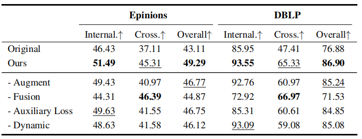
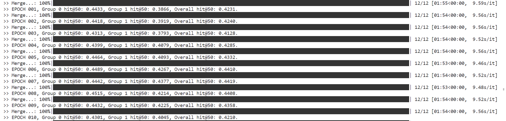

## 复现结果
gat: Group 0 hit@50: 0.3683, Group 1 hit@50: 0.3433, Overall hit@50: 0.3594, 
gin: Group 0 hit@50: 0.4306, Group 1 hit@50: 0.4001, Overall hit@50: 0.4197,
sage: Group 0 hit@50: 0.3451, Group 1 hit@50: 0.3366, Overall hit@50: 0.3421, 
ultragcn: Group 0 hit@50: 0.4579, Group 1 hit@50: 0.4512, Overall hit@50: 0.4555, 
LightGCN: Group 0 hit@50: 0.5345, Group 1 hit@50: 0.5008, Overall hit@50: 0.5225, 

## 消融实验
所有的结果都是基于基于jaccard的增强。都是基于LightGCN。

1. 监督增强对我们的框架的影响；
2. 嵌入融合模块对我们的框架的影响；
3. 等式中两个辅助损失函数的影响；
4. 训练嵌入融合模块过程中动态训练策略的影响。

### -Augment
将通过Jaccard系数选择的增强的交联信号替换为跨不同社区的随机节点对。
true_aug=0，进行虚假增强，随机选择前augment_size条增强边

epinions: Group 0 hit@50: 0.4825, Group 1 hit@50: 0.4099, Overall hit@50: 0.4502

DBLP:Group 0 hit@50: 0.9265, Group 1 hit@50: 0.6068, Overall hit@50: 0.8583.

### -Fusion
model_cal=AverageMerger()
以一种简单的方式将ZA融合到ZO中，简单的平均。
1. Group 0 hit@50: 0.4779, Group 1 hit@50: 0.4045, Overall hit@50: 0.4518.
2. Group 0 hit@50: 0.8589, Group 1 hit@50: 0.5136, Overall hit@50: 0.7776

### -Auxiliary Loss
注释掉e2e_train的前半部分对双GNN的训练过程
1. Group 0 hit@50: 0.4944, Group 1 hit@50: 0.4326, Overall hit@50: 0.4724.9
2. Group 0 hit@50: 0.9092, Group 1 hit@50: 0.5929, Overall hit@50: 0.8347.

### -Dynamic
设置一个固定的学习速率γ和训练步骤S
~~~python
LR = args.alpha * 1 / (1 + math.exp(-EPOCH + args.threshold))
STEP = int(args.beta * 1 / (1 + math.exp(-EPOCH + args.threshold))) + 1

LR = 0.01
STEP = 12
~~~

在5个EPOCH的时候就收敛了

1. Group 0 hit@50: 0.4539, Group 1 hit@50: 0.4203, Overall hit@50: 0.4419.

2. Group 0 hit@50: 0.7429, Group 1 hit@50: 0.3418, Overall hit@50: 0.6484, 

## 对比
我将使用LightGCN与论文方法进行比较。

### LightGCN简述
在LightGCN中采用了简单的加权和聚集器，放弃了特征变换和非线性激活。LightGCN中图卷积运算为：
$$
\mathbf{e}_\mathrm{u}^{(\mathrm{k}+1)}\:=\:\sum_{\mathrm{i}\in\mathcal{N}_\mathrm{u}}\:\frac{1}{\sqrt{\mid\mathcal{N}_\mathrm{u}\mid\mid\mathcal{N}\mathrm{i}\mid}}\:\mathbf{e}_\mathrm{i}^{(\mathrm{k})}
$$

$$\mathbf{e}_\mathrm{i}^{(\mathrm{k}+1)}\:=\:\sum_{\mathrm{u}\in\mathcal{N}_\mathrm{i}}\:\frac{1}{\sqrt{\mid\mathcal{N}_\mathrm{u}\mid\mid\mathcal{N}\mathrm{i}\mid}}\:\mathbf{e}_\mathrm{u}^{(\mathrm{k})}$$

在LightGCN中，**唯一可训练的模型参数是第0层的嵌入**，即$\mathrm{e}_\mathrm{u}^{0}$表示所有用户，$\mathbf{e}_\mathrm{v}^{0}$表示所有项目。当给定它们时，就可以通过上述公式中定义的LGC计算更高层的嵌入。经过K层LGC之后，进一步结合在每一层得到的嵌入，形成一个用户(一个项目)的最终表示
$$\mathrm{e_u~=\sum_{k=0}^K\alpha_k~e_u^{(k)};  e_i~=\sum_{k=1}^K\alpha_k~e_i^{(k)}}$$

其中$\alpha_\mathrm{k}\geq0$表示第k层嵌入的权重。作者在实验中发现设置$\mathfrak{\alpha}_\mathrm{k}$统一为$1/(\mathbb{K}+1)$的性能较好。

最后，模型预测定义为用户和项目最终表示的内积：
$$\hat{\mathrm{y}}_\mathrm{ui}=\mathrm{e}_\mathrm{u}^\mathrm{T}\mathrm{e}_\mathrm{i}$$

1. Group 0 hit@50: 0.4582, Group 1 hit@50: 0.3672, Overall hit@50: 0.4258.

2. Group 0 hit@50: 0.7754, Group 1 hit@50: 0.3432, Overall hit@50: 0.6737.

## 改进实验
1. Group 0 hit@50: 0.5129, Group 1 hit@50: 0.4944, Overall hit@50: 0.5063

2. Group 0 hit@50: 0.8882, Group 1 hit@50: 0.6005, Overall hit@50: 0.8205, 

